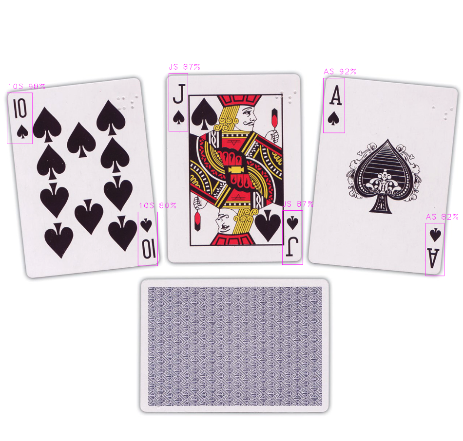
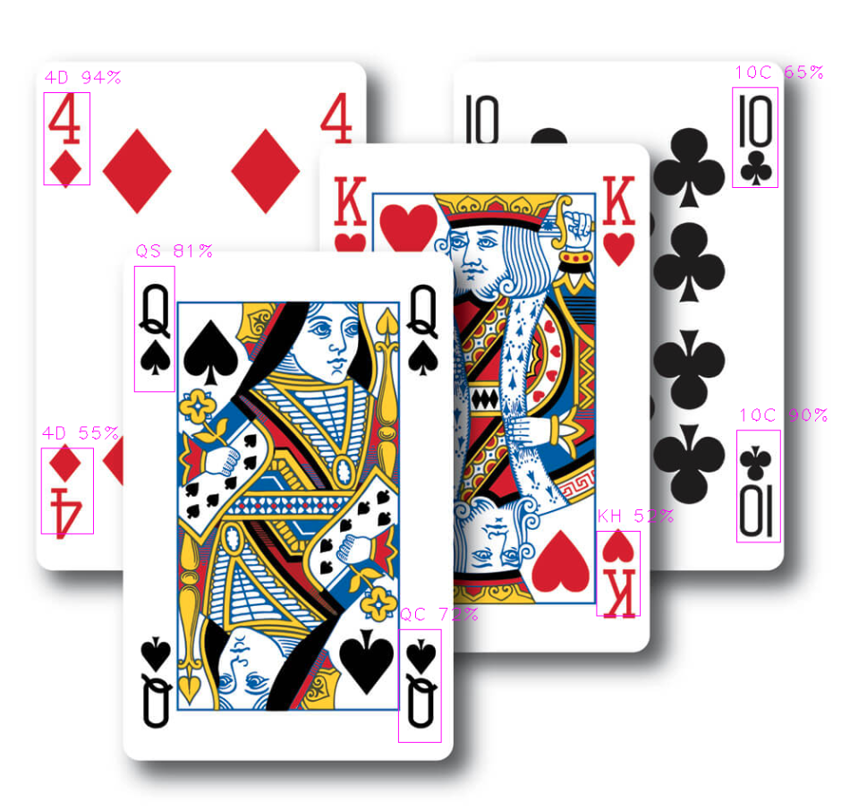
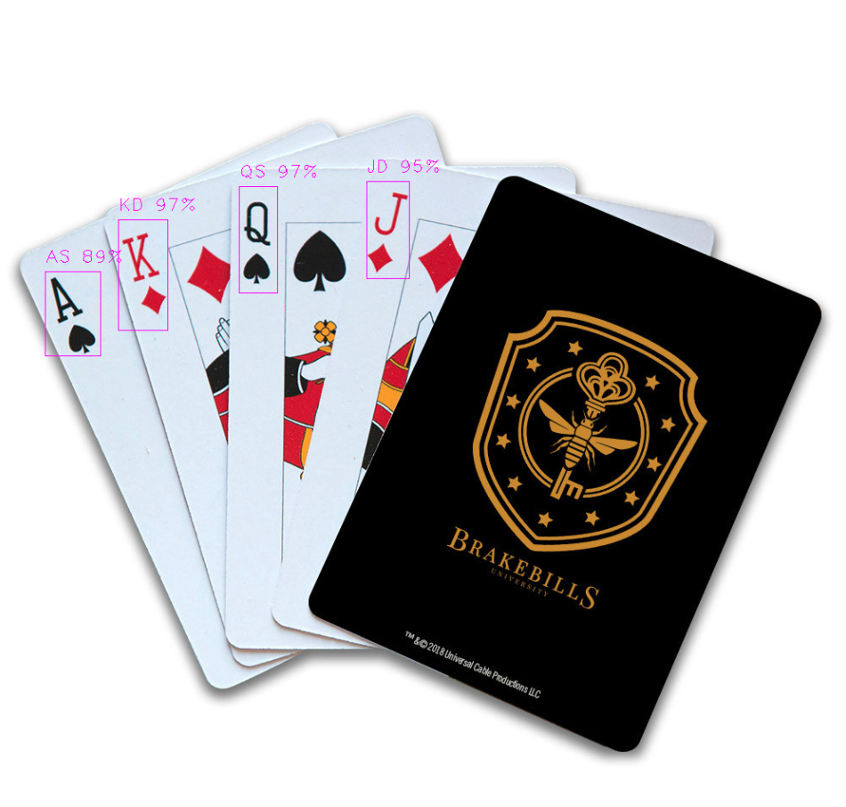

# YOLO v3 Card Detection
Python script that uses a YOLO v3 trained model to detect card numbers and types from a deck of cards.

#### Thanks to Geaxgx who develop all the steps to custom train a model
https://github.com/geaxgx/playing-card-detection

#### Download model weights
https://drive.google.com/drive/folders/15_SebB7ZylDQoyFn4xpBUgiUrMvpTDOT?usp=sharing

`yolocards_608.weights` file goes inside /yolov3 folder

#### Screenshots

###### Example 01

###### Example 02

###### Example 03

## Requirements
`Python3`
`opencv-python`
`numpy`

## Contributing

1. Fork it (<https://github.com/xtokio/yolocards/fork>)
2. Create your feature branch (`git checkout -b my-new-feature`)
3. Commit your changes (`git commit -am 'Add some feature'`)
4. Push to the branch (`git push origin my-new-feature`)
5. Create a new Pull Request

## Contributors

- [Luis Gomez](https://github.com/xtokio) - creator and maintainer